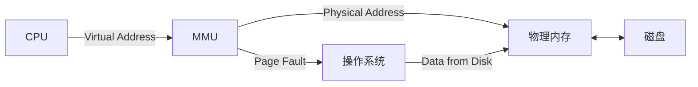

# 虚拟内存技术

## 虚拟内存基础概念

### 虚拟地址空间 (Virtual Address Space)

- **定义:** 操作系统为每个进程提供的、看起来连续的、私有的内存空间。它是对物理内存和磁盘空间的抽象
- **作用:**
  - 隔离进程，提供保护
  - 简化内存管理，允许程序使用比物理内存更大的地址空间
  - 实现内存共享

- 相关术语:
  - **进程空间:** 通过链接器装配链接而形成的规范布局。含有**OS使用的系统空间**和**用户空间**
  - **交换分区:** 按页划分的连续的磁盘空间。在物理内存不够的情况下，操作系统先把内存中暂时不用的数据，存到硬盘的交换空间

### 关键问题

- 地址映射问题: 进程空间到虚拟存储的映射问题
- 调入问题: 哪些程序和数据应被调入主存？何时调入？如何调入 (缺页处理)？
- 替换问题: 决定哪些程序和数据应被调出主存
- 更新问题: 确保主存与辅存的一致性

## 虚拟页式内存管理

也可以看作一种内存“扩充”技术

### 基本原理

原理:

- **按需装载**: 在程序装入时，不必将其全部读入到内存，而只需将当前需要执行的部分页或段读入到内存，就可让程序开始执行
- **缺页调入**: 如果程序需执行的指令或访问的数据尚未在内存 (称为缺页或缺段)，产生页错误 (Page Fault)，则由处理器通知操作系统从磁盘将相应的页或段调入到内存，然后继续执行程序
- **不用调出**: 操作系统将内存中暂时不使用的页或段调出保存在外存上

### 核心策略

1. 取页策略 (Fetch Policy): 决定何时将页面从磁盘调入内存
   - OS在系统启动时调入
   - **请求调页:** 发生缺页时才调入
   - **预调页:** 预测并提前调入
2. 放置策略 (Placement Policy): 决定将调入的页面放置在物理内存的哪个页框 (Page Frame) 中
   - 在分页系统中，任何空闲页框都可以存放任何页面，所以此策略相对简单
3. **置换策略:** 当内存没有空闲页框时，决定选择哪个页框中的页面换出到磁盘

### 与“Cache-主存”机制的比较

- 二者侧重点不同: 
  - cache主要解决主存与CPU的**速度差异**问题
  - 虚存主要解决**存储容量**问题
- 数据通路不同:
  - CPU与cache和主存之间均有直接访问通路，cache不命中时可直接访问主存
  - 辅存与CPU无直接通路，主存不命中时需要调页，最终还是访问主存

## 硬件支持与核心机制

### 页表表项 (PTE) 设计

关键字段:

- **页框号 (Page Frame Number - PFN):** 该虚拟页对应的物理内存块号
- **有效位/驻留位 (Valid/Present Bit - P):** 标记该页是否在物理内存中 (1=在内存, 0=不在内存，在磁盘)
- **访问位/引用位 (Accessed/Referenced Bit - A/R):** 标记该页近期是否被访问过 (硬件在访问时设置，OS定期清零)。用于置换算法
- **保护位 (Protection Bits - R/W/X):** 控制对该页的访问权限（读/写/执行）
- **修改位/脏位 (Dirty/Modified Bit - D/M):** 标记该页在内存中是否被修改过 (硬件在写入时设置)。如果为1，换出时必须写回磁盘

例子: Intel的页目录项 PDE (Page Directory Entry) 和页表项 PTE (Page Table Entry):

### 内存管理单元 (MMU)

- **定义:** CPU中的硬件单元，负责将虚拟地址转换为物理地址
- **过程:** 接收CPU发出的虚拟地址，查询页表（优先查TLB），生成物理地址或触发缺页异常

### 地址转换

**硬件机制:**

1. CPU发出虚拟地址
2. MMU 从虚拟地址中提取**虚拟页号 (VPN)**和**页内偏移 (Offset)**
3. MMU 使用 VPN 查找页表（先查TLB）
4. 检查 PTE:
   - Case 1: PTE 有效 (Valid/Present bit = 1) 且权限允许:
     - 从 PTE 中获取 **页框号 (PFN)**
     - 将 PFN 与页内偏移拼接，形成**物理地址**
     - 访问内存
     - 硬件根据访问类型（读/写）可能设置**访问位 (A)**或**修改位 (D)**
   - Case 2: PTE 无效 (Valid/Present bit = 0) 或权限不足:
     - MMU 产生 **页错误 (Page Fault)** 异常，将控制权交给操作系统

**页错误处理 (OS):** 详见下文

### 快表 (TLB)

**问题:** 多级页表导致每次地址翻译需要多次内存访问，显著降低性能

**原理:** 利用程序访问的局部性原理，最近访问过的页面很可能再次被访问

**什么是TLB:**

- 一种高速的、容量小的**相联存储器 (Associative Memory)**
- 特点: 按**内容**并行查找，速度极快
- 存储内容: 缓存近期使用过的**虚拟页号 (VPN) 到页框号 (PFN) 的映射** (即部分活跃的页表项)

**工作流程:**

1. MMU 收到虚拟地址后，**首先并行查找 TLB**
2. **TLB Hit (命中):** 如果在 TLB 中找到匹配的 VPN，直接获取 PFN，快速完成地址转换。跳过页表查找
3. TLB Miss (未命中):
   - MMU 需要访问内存中的页表进行查找
   - 找到 PFN 后，**将 (VPN -> PFN) 的映射关系装入 TLB** (可能需要替换掉 TLB 中的一个旧条目，使用LRU等策略)
   - 完成地址转换

**TLB 刷新问题:**

- **问题:** 进程切换时，原进程的 TLB 条目对新进程无效，需要刷新 TLB，导致新进程初期 TLB Miss 增多，性能下降
- ASID解决: 用 **PCID (Process Context Identifier) / ASID (Address Space Identifier)** 给 TLB 条目打上进程标识符。切换进程时，只需加载新进程的 PCID/ASID，TLB 中带有不同 ID 的条目不会被匹配，无需完全刷新

**关键参数:** TLB 的大小、位置（通常集成在MMU或CPU核心内）、替换策略

### 缺页异常 (Page Fault) 处理

**触发:** 地址转换过程中，MMU 发现所需页面的 PTE 无效或访问权限不足

**本质:** 一种硬件中断/异常，将控制权交给操作系统内核的**缺页异常处理程序 (Page Fault Handler)**

**处理流程 (典型情况 - 页面不在内存):**

1. **保存现场:** 保存用户进程的状态 (PC, 寄存器等)
2. **确定原因:** 操作系统分析是真缺页 (P=0)，还是保护性错误 (权限不足)。如果是后者，可能终止进程
3. **定位磁盘地址:** 如果是真缺页，查找该虚拟页在磁盘 (交换空间或文件) 上的位置
4. **查找空闲页框:** 在物理内存中寻找一个空闲的页框
5. 处理无空闲页框:
   - **若无空闲页框:** 执行**页面置换算法**，选择一个牺牲页框 (Victim Frame)
   - **写回脏页:** 如果牺牲页框中的页面是“脏”的 (D=1)，则需要将其内容**写回磁盘**
6. **调入页面:** 启动磁盘 I/O 操作，将保存在磁盘上的页面内容复制到该页框中
7. **更新页表:** 页面调入完成后，修改该虚拟页对应的 PTE (Page Table Entry): 设置 P=1，填入 PFN，清除 D 位，可能设置 A 位
8. **恢复现场:** 恢复用户进程的状态
9. **重新执行指令:** 重新执行导致缺页异常的指令。此时地址转换可以成功

## 页面置换算法

### OPT算法

- 置换**未来最长时间内不会被访问**的页面。因为需要预知未来，所以无法实现。用作性能比较的基准

### FIFO算法

- **Belady现象:** 

  - 分配的页面数增多但缺页率反而提高的异常现象

  - 原因: FIFO 只考虑进来的时间，不考虑进来之后的访问情况。增加页框可能导致一个“坏”的页面（未来会用到）驻留更久，从而在后面挤掉了更有用的页面

  - **LRU 和 OPT 不存在 Belady 异常:** 因为它们满足**栈属性**，即 `m` 个页框时的内存内容总是 `m+1` 个页框时内存内容的子集。增加页框只会包含更多有用的页，不会导致缺页增加

- Second Chance算法: 改进的FIFO。进队时标志位置1，如果即将淘汰的页面的标志位为1，则此轮不会被换出，放到队首，但将访问标志位清除

  

- Clock算法: 改进的Second Chance。通过一个环形队列，避免将数据在FIFO队列中移动

- FIFO类算法命中率比较低，实际很少使用

### LRU算法

- 设置栈保存使用过的页面号，每次访问就把页面压入栈顶，栈底始终是最近最久未使用的页面

- Aging算法: LRU的简化。R表示页面在一个时钟周期内的访问情况，每过一个时钟周期，对计数器进行移位并把R值拼在最前，淘汰计数器值最小的页面

  

## 高级内存管理策略

### 驻留集管理

**驻留集 (Resident Set):** 进程当前在物理内存中的页面集合

驻留集大小管理: 决定给每个进程分配多少页框

- 固定分配策略 (Fixed Allocation):
  - 在进程创建时确定分配的页框数量
  - 分配依据可以是: 进程类型（交互式、批处理、应用类型）/ 程序员指定的需求 / 系统管理员设置的策略
  - 特点: 简单但缺乏灵活性，无法适应进程工作集大小的动态变化
- 可变分配策略 (Variable Allocation):
  - 根据**进程的缺页率**动态评估其局部性表现
  - 缺页率高 → 增加页框数（扩大驻留集）；缺页率低 → 减少页框数（缩小驻留集）
  - 缺点: 实现复杂，需要监控缺页率，调整策略可能引入系统开销

### 工作集模型

基本思想: 由程序访问的局部性原理，一个进程在任何时刻都倾向于访问一个相对较小的页面集合，称为**活跃页面 (Active Pages)**。如果能将这些活跃页面都保留在内存中，就能显著减少缺页

**工作集 (Working Set) W(t, Δ):** 在当前时间 `t` 之前的时间窗口 `Δ` 内，进程实际访问过的虚拟页面的集合

与驻留集的关系: 理想状态下，进程的驻留集应包含其当前的工作集 ( Resident Set >= Working Set )

工作集策略应用:

- **置换:** 换出不在当前工作集中的页面
- 加载控制: 只有当一个进程的工作集能够被完全调入内存时，才激活该进程运行，否则挂起。防止抖动 Thrashing

### 抖动

现象: 随着驻留内存的进程数目增加，进程并发水平上升，处理器利用率先是上升，然后下降，因为缺页率上升

预防与消除:

- 局部置换策略
- 引入工作集算法
- 预留部分页面
- 挂起若干进程

### 工作集算法

基本思路: 识别并换出不在当前工作集 W(t, Δ) 中的页面

一种实现:

- PTE 增强: 每个 PTE 增加一个字段，记录该页面的**最后访问时间 (Last Use Time)**
- 参数: 设置一个时间阈值 `T` (近似 Δ)

扫描过程 (类似时钟):

1. 定期或缺页时扫描页框
2. 检查 PTE 的 A 位：

   - 若 A=1: 表示在当前时钟滴答内被访问。记录当前虚拟时间到 PTE 的“最后访问时间”字段，并将 A 清零
   - 若 A=0: 表示在当前滴答内未被访问。计算**页面年龄 (Age) = 当前虚拟时间 - 最后访问时间**

3. 判断与置换:

   - 如果 Age $>$ T (页面“老”，不在工作集内):

     - 如果页面是干净的 (D=0)，则该页面是**最佳**牺牲页，直接置换
     - 如果页面是脏的 (D=1)，先记录下来，继续扫描，希望能找到一个干净的老页面。如果找不到干净的老页面，最后回来置换这个脏的老页面（需要写回磁盘）
   - 如果 Age $\leqslant$ T (页面“年轻”，在工作集内)，保留该页面，继续扫描

讨论:

- 精确实现工作集算法开销较大（需要记录和比较时间）
- 缺页率算法 (Page Fault Frequency - PFF): 一种近似方法。通过监控进程的缺页率来动态调整其驻留集大小
  - 设置缺页率上限和下限
  - 缺页率 $>$ 上限: 增加进程的页框数
  - 缺页率 $<$ 下限: 减少进程的页框数

## 内存映射文件 (Mem-Mapped File)

- 思想: 将IO变成访存，简化读写操作 (无需使用 `read()` / `write()` 系统调用)，允许共享
- 实现: 进程通过 mmap 系统调用将一个文件或部分映射到其虚拟地址空间的一部分，再对内存进行访存操作，最后通过close让内存写回磁盘 (有不安全问题，比如修改了内存，但是断电了)

## 写时拷贝

### Copy-On-Write

- 两个进程共享同一块物理内存，每个页面都被标志成了写时复制。写的时候复制一份页面，再在副本上写。原本的页面只有"只读"属性

- Linux `fork()` 让父进程和子进程共享同一个拷贝

  

### 信息同步

主存作为辅存 (即磁盘) 的高速缓存，保存了磁盘信息的副本，需要保持主辅存信息的一致性

- file backed型: 磁盘上的文件
  - 页面被换出时，如果未被修改，则丢弃，因为磁盘上保存有相同的副本
  - 如果已被修改，则写回原位置
- anonymous型: 进程运行时动态生成
  - 若未被修改，第一次换出则写入swap区，非第一次则丢弃
  - 若已被修改，则写入swap区

## 页目录自映射

### 原理

给一个虚拟地址，我们通过查找内存中的页目录和页表，可以找到其物理地址。此时，页目录和页表的虚拟地址不重要，因为我们只用到了他们的物理地址。但是，我们会想知道页目录和页表的虚拟地址是什么，以便内核直接通过虚拟地址查看页表。

页表总共占4MB，页目录占 $2^{10} \times 4\mathrm{B}$，恰好是一个页表页的大小 4KB。先说结论吧，我们把页目录当作一个页表，让页目录中的一条PDE指向指向自身的物理地址，就能实现虚拟地址的统一转化。

如果把存放了页目录自身物理地址的项放在页目录的第 t 项，那么他对应的二级页表应该管理 [0x(t)00...00, 0x(t)ff...ff] 这 4MB 的虚拟空间。不如就把这 4MB 空间拿来存 1024 个二级页表。

我们让所有的二级页表都放在 0x(t)00...00 到 0x(t)00...00+4MB 范围内

现在的地址翻译就变得非常和谐。普通页的翻译和原来一样。

设第 k 张二级页表页的虚拟地址为 0x(t)(k)0，交给MMU后，MMU首先找到寄存器中的页目录的物理地址，然后找到页目录的第 t 项，页目录项中的物理地址——也就是**页目录本身的物理地址**，作为“二级页表”的地址，接着，MMU查询“二级页表”的第 k 项，也即拿到第 k 张二级页表的物理地址。任务完成。

设页目录的虚拟地址是 0x(t)(t)0，MMU首先找到寄存器中的页目录的物理地址，然后找页目录的第 t 项，读出其中的物理地址，也就是页目录本身的物理地址。接着，MMU查询二级页表的第 t 项，最终得到的物理地址为页目录的物理地址，任务完成。

综上所述，通过“页目录自映射”，我们简洁而和谐地让一级页表、二级页表这些信息也可以像“普通页”一样用虚拟地址来访问。

### 地址计算

`PT_base` : 页表基址，应4M对齐，`PT_base = (PT_base >> 22) << 22`

`PD_base` : 页目录表基址，`PD_base = PT_base | (PT_base >> 10)`

`PDE_{self-mapping}` : 自映射页目录表项 ，为 `PT_base | (PT_base >> 10) | (PT_base >> 20)`

---

Reference

- [知乎｜什么是页表自映射](https://zhuanlan.zhihu.com/p/452598045)