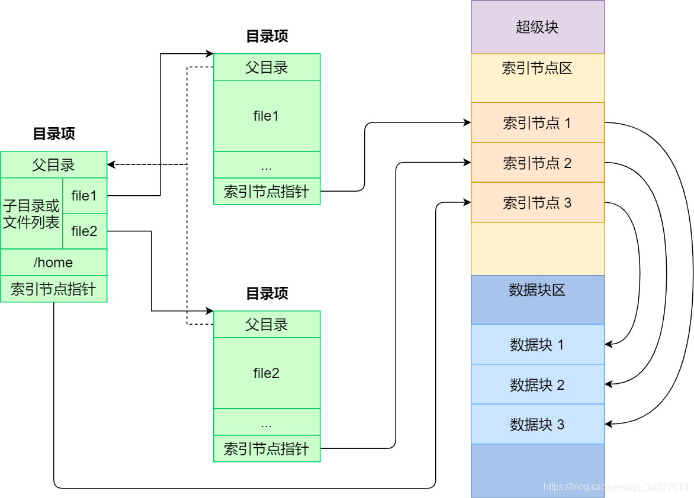

# 文件系统

> Thus far we have seen the development of two key operating system abstractions: the process, which is a virtualization of the CPU, and the address space, which is a virtualization of memory. In tandem, these two abstractions allow a program to run as if it is in its own private, isolated world; as if it has its own processor (or processors); as if it has its own memory.
>
> In this section, we add one more critical piece to the virtualization puzzle: **persistent storage**. A persistent-storage device is where users keep data that they really care about.

## 文件系统基础概念

### 文件 (File)

**核心定义:** 文件是操作系统对持久性存储介质 (主要是磁盘) 上存储数据的一种**抽象**，它将底层存储的物理细节 (如扇区、磁道) 隐藏起来，提供给用户一个逻辑上的、带名字的数据单元

**逻辑视图:** 文件被视为一组带标识 (文件名) 的、在逻辑上有完整意义的**信息项**的序列

- **信息项:** 构成文件内容的基本单位 (单个或多个字节)，信息项之间有顺序
- **意义:** 文件存储什么内容、这些内容如何解释 (是文本、图像还是程序)，是由创建和使用该文件的用户或应用程序决定的，文件系统本身不关心

**Unix哲学 — “万物皆文件”:**

- 例子:
  - 硬件设备: 磁盘分区 (`/dev/sda2`)、终端 (`/dev/tty2`)、打印机等都表现为 `/dev` 目录下的特殊文件，对这些文件进行读写操作就相当于与对应的硬件设备交互
  - 内核信息: 内核本身 (`/boot/vmlinuz...`) 和内核运行时的状态、参数 (`/proc` 目录下的各种“文件”) 也都以文件形式存在
- **好处:** 提供了统一的访问接口，应用程序可以使用相同的系统调用 (`open`, `read`, `write`, `close`) 来处理普通文件、设备、管道等，大大简化了编程模型

### 文件系统 (File System)

**定义:** 文件系统是操作系统中负责**管理文件** (即管理持久性数据) 的子系统

**具体职责 (详细):**

- **空间管理:** 像一个地产商，管理磁盘这块“土地”，知道哪些“地块” (磁盘块) 空着，哪些已经“盖了房子” (被文件占用)。负责“批地” (分配块) 和“拆迁回收” (回收块)
- **命名与定位:** 实现“按名存取”。用户提供一个“地址” (文件名或路径)，文件系统负责找到对应的“房子” (文件数据) 在磁盘上的实际物理位置，这是一个从逻辑名字到物理地址的**映射**过程
- **共享与安全:** 允许多人“合租”一个文件 (共享)，并设置门禁 (权限控制)，保证数据的安全和可靠
- **用户接口:** 提供一套标准的操作工具 (系统调用)，让用户能方便地“建房子” (创建文件) 、“装修” (写入数据) 、“查看” (读取数据) 、“改名” (重命名) 、“拆除” (删除文件) 等
- **性能优化:** 通过缓存、预读、合理的布局等手段，让文件的读写尽可能快
- **设备无关性:** 与I/O子系统协作，使得上层应用不需要关心底层是HDD、SSD还是其他存储设备

### 文件属性与文件控制块 (FCB)

**文件属性 (Metadata):** “关于文件的数据”，描述文件本身特征的信息，而不是文件内容。常用属性有文件名、文件地址 (指向文件数据在磁盘上存储位置的关键信息，是FCB的最重要部分之一)、时间戳等

**文件控制块 (FCB, File Control Block):**

- **核心数据结构:** 操作系统为了管理文件而设置的数据结构，**每个文件都有一个对应的FCB**
- **内容:** 存储了该文件的**所有属性信息**
- **位置:** FCB通常存储在磁盘上，当文件被打开时，其FCB (或部分信息) 会被加载到内存中
- 注意: FCB 是教材中的抽象概念，inode 是它在 Unix 文件系统中的具体实现 (是类和实例的关系)

## 文件目录

### 目录、目录项与目录文件

文件目录 (File Directory):

- **作用:** 提供了**从文件名到文件属性和位置信息的映射**，是文件系统用于组织和管理文件的核心机制
- **逻辑结构:** 通常表现为层次结构 (树形)，方便用户组织文件
- **实现:** 本质上是一个**符号表**，存储了文件名与其对应文件控制信息 (FCB或inode) 之间的关联

目录项 (Directory Entry):

- **定义:** 目录文件中的基本组成单位，每个目录项代表目录下的一个文件或子目录
- 内容: 是**用户看到的文件名**和**inode**的映射 (每个文件和目录都有一个inode，比较底层)

目录文件 (Directory File):

- **存储:** 文件目录本身也需要持久化存储在磁盘上，操作系统通常将目录实现为一种**特殊类型的文件**，称为目录文件
- **内容:** 目录文件的内容就是一系列的**目录项**
- **访问:** 对目录的操作 (如创建文件、删除文件、列出目录内容) 实际上就是对相应目录文件的读写操作

### 目录结构

目前操作系统最广泛采用**树形目录结构**，有一个**根目录 (Root Directory)** `/` 作为起点，每个目录可以包含文件和其他子目录，例如:


优点是结构清晰，易于组织和管理文件，不同用户可以拥有自己的子目录，文件名只需在同一目录下唯一

### 目录文件的组织方式

(目录文件内部如何存储和组织目录项)

顺序表 (Linear List):

- 方式: 将目录项一个接一个地顺序存放在目录文件中，可以是定长记录 (简单) 或变长记录
- 缺点:
  - **查找效率低:** 需要线性扫描目录项来查找特定文件名，对于大目录非常慢 (O(n))
  - **删除复杂:** 删除目录项可能需要在文件中留下空洞，或者需要移动后续项来填补空洞

散列表 (Hash Table):

- 方式: 使用文件名作为键，通过散列函数计算出一个索引值，直接定位到散列表中的一个桶 (slot) ，目录项存储在对应的桶中
- 优点: 查找速度非常快 (平均 O(1))
- 缺点: 需要设计好的散列函数和冲突解决策略，表的大小需要预估

B树 / B+树:

- 方式: 使用平衡树结构 (特别是B+树) 来组织目录项，目录项按文件名排序存储在树的叶子节点中
- 优点:
  - **查找、插入、删除效率都较高且稳定** (O(log n))
  - **支持范围查询** (按字母顺序列出文件)
  - 树结构可以动态增长和收缩
- 应用: 现代文件系统 (如 NTFS, ext4, APFS) 常用 B 树或 B+ 树来组织目录

## 文件系统的实现

### 文件的物理结构

文件在存储介质上的存放方式，包括: 顺序/连续结构、串联/链接结构、索引结构。

**连续结构:**

- 适用于变化不大的顺序访问文件


**串联结构:**

- 实现: 文件的信息存于若干物理块中 (不一定连续)，每个物理块的最末一个字作为链接字，指出后继块的物理地址
- 优点: 顺序存取效率高；文件动态扩充和修改容易
- 缺点: 随机存取效率太低 (如果访问文件的最后的内容，则要访问整个文件)


**索引结构:**

- 实现: 系统为每个文件建立一个索引表，并将文件的物理块的块号存放在该索引表中，FCB记录索引表的地址
- 应用: Unix采用


- 索引表有两种组织方式:

  - 链接模式 (直接索引): 就是上图中的方式，直接从索引表读出所有物理块号
  - 多级索引 (间接索引): 
  - 或者二者的混用: 索引表的前几项直接索引；接下来的一项指向一级索引表；再接下来的一项指向二级索引表


### 磁盘管理

**位图法 (Bitmap / Bit Vector):**

- 使用一个**位向量 (Bit Array)**，每一位对应磁盘上的一个物理块。例如，位图的第 `i` 位代表磁盘上的第 `i` 块
- 状态表示: 通常用 `1` 表示块空闲，`0` 表示块已分配 (或者反过来，约定一致即可)
- 优点: 实现简单直观，很容易找到连续的空闲块
- 缺点: 位图本身可能很大 (位图通常需要加载到内存以提高效率)

**空闲块链表 (Free Block Linked List):**

- 将所有空闲的磁盘块通过指针链接成一个**链表**，文件系统只需要在超级块或特定位置存储**链表的头指针** (指向第一个空闲块)，每个空闲块内部存储指向下一个空闲块的指针
- 分配: 从链表头部取下一个块进行分配，并更新头指针指向原来的第二个块
- 回收: 将被释放的块插入到链表的头部 (最简单) ，更新头指针
- 优点: 实现简单，管理开销小 (只需一个头指针)
- 缺点:
  - **分配回收效率低:** 每次分配/回收都需要读写磁盘块来获取/修改指针
  - **难以分配连续块:** 无法方便地找到连续的空闲块
  - **链表可能遍历整个磁盘:** 如果空闲块分散，效率更低

**成组链接法 (Grouping / Counting - UNIX V6 采用):**


- 方式: 对空闲链表的改进，旨在减少磁盘 I/O 次数
  1. 将空闲块分成若干**组** (例如，每组最多100个块)
  2. 每组的第一个块 (“组长块”) 不直接存储数据，而是用来存储:
     - 下一组空闲块的**组长块号** (指针)
     - 本组内包含的空闲块**数量** (如 count = 99)
     - 本组内其余 99 个空闲块的**块号列表**
  3. 文件系统在**内存中** (如超级块的一部分，称为“专用块或栈) 维护当前可直接分配的一组块的信息

- 分配:
  1. 检查内存中当前组的空闲块数 `s.n`
  2. 如果 `s.n > 0` ，直接从内存列表 `s.free` 中取出一个块号 (如 `s.free[s.n]`)，将 `s.n` 减 1，返回该块号 **(无磁盘 I/O)**
  3. 如果 `s.n == 0` (内存中的组已用完)
     - 获取下一组的组长块号 `next_group_leader` (可能存在 `s.free[0]` 中)
     - 如果 `next_group_leader == 0` ，表示磁盘空间已满，分配失败
     - 否则，**读取** `next_group_leader` 这个磁盘块的内容 (包含下一组的数量和块号列表) 到内存的 `s.n` 和 `s.free` 中 **(一次磁盘读)**
     - 将 `next_group_leader` 这个块本身作为本次分配的结果返回
- 回收: (回收块号为 `block_num` )
  1. 检查内存中当前组的空闲块列表是否已满 (比如 `s.n == 100`)
  2. 如果未满，将 `block_num` 加入内存列表 `s.free`，并将 `s.n` 加 1 **(无磁盘 I/O)**
  3. 如果已满:
     - 将内存中 `s.n` 和 `s.free` 列表 (包含100个块号) **写入**到要回收的 `block_num` 这个磁盘块中，使其成为新的组长块 **(一次磁盘写)**
     - 将内存中的 `s.n` 置为 1
     - 将内存列表 `s.free[1]` (或 `s.free[0]`) 设置为 `block_num` (现在只知道这一个新的组长块是空闲的)

## Linux文件系统

Linux为每个文件分配两个数据结构:

- 索引节点 (inode): 主要包含文件的属性 + 文件数据块的位置（直接索引+间接索引
- 目录项 (directory entry): 文件名 $\leftrightarrow$ inode编号 (ps. 不用inode的话，文件控制块的内容就存在目录项中)

## 文件操作流程

ps. 我觉得这图的右边是准确的，左边不应该一个目录项含有多个file？



每个目录项包含:

- 一个文件名，如 `"hello.txt"`
- 一个 inode 编号，如 `inode #1234`

inode 提供数据块的地址 (我觉得与MOS中的FCB相似)。如果 inode 表示一个目录，它的数据块中存储的就不是“普通的文件数据”，而是一个个**目录项**，也即存放

```json
[
    { file_name: "d0", inode_num: 100 },
    { file_name: "d1", inode_num: 101 },
    ...
]
```

一个目录包含多个目录项。目录项通常需要被读到内存中，而inode存放在磁盘中

读取 `/usr/file.c` 的流程:

1. 从磁盘读入 `/` 的所有目录项 (通常已经在内存中)，遍历这些目录项，找到 file_name 为 `usr` 的目录项，例如 `"usr" → inode_1`
2. 把 inode_1 读入内存
3. 访问 inode_1 指向的磁盘块，会遍历所有指向的数据块，读入内存，即这里进行了磁盘访问。因为 `usr` 是个目录，所以读入的数据块的内容是目录项，再由操作系统判断是否有 file_name 为 `file.c` 的项。如果不是，则继续读 inode_1 指向的下一个数据块
4. 当读到 `file.c` 对应的目录项后，假设是 `"file.c" → inode_2` ，我们便可以循环读出 inode_2 指向的磁盘块，也就读到了 `file.c` 的内容


不要inode就直接 `file_name → 磁盘地址`

普通文件的目录项记录了文件的所有内容对应的磁盘块号，如果是目录，则其目录项记录了子目录对应的磁盘块号？

> 作业6的第六题(1)做错了，好像不用inode: 
>
> // 错误答案
>
> `/` 的目录项已经在内存中 (意思是 `/` 的 inode 所指向的数据块已经被读入内存中)，我们可以找到其下的 `usr2` 的目录项 `usr2 → inode x` ，然后加载 inode x，查看其数据块
>
> 因为 `usr2` 下最多有 128 个第三级目录，所以对应着 128 个目录项，而 1 个目录项 128B，1 个磁盘块 1KB，所以这些目录项需要 128 / (1K / 128) = 16 个磁盘块，平均访问磁盘次数为 (1 + 16) / 2 = 8.5 次
>
> 现在得到了 `usr2` 目录项，可以找到其下的目录项 `dx → inode y` ，加载 inode y 的数据块
>
> 由题意，目标文件 `f` 在第三级目录下，且其对应的第三级目录的目录项可以一次从磁盘读出，所以，只加载磁盘 1 次就能得到 `f` 对应的目录项 `f → inode z` ，进而加载 inode z 的数据块
>
> 文件的平均大小为 100KB，占有 100KB / 1KB = 100 块，访问一个块平均需要访问磁盘 (1 + 100) / 2  = 50.5 次
>
> 综上，访问文件的一个块平均需要访问磁盘 8.5 + 1 + 50.5 = 60 次

## 文件系统实例

### FAT (FAT12/FAT16/FAT32)


### EXT2

ext2文件系统的访问过程，需要多少次磁盘I/O

### Linux VFS


### LFS

