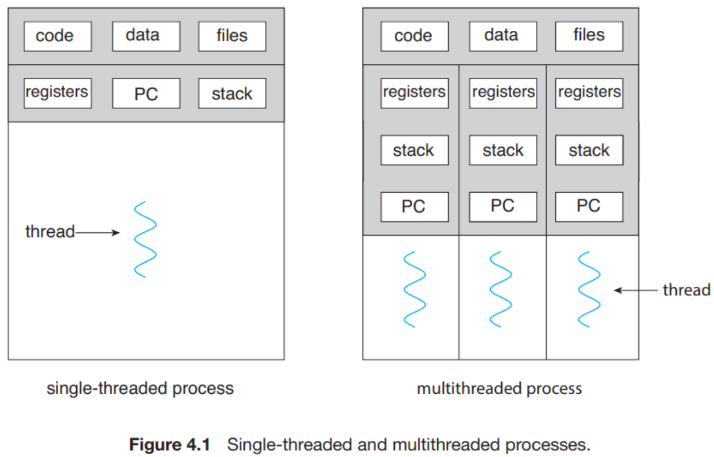
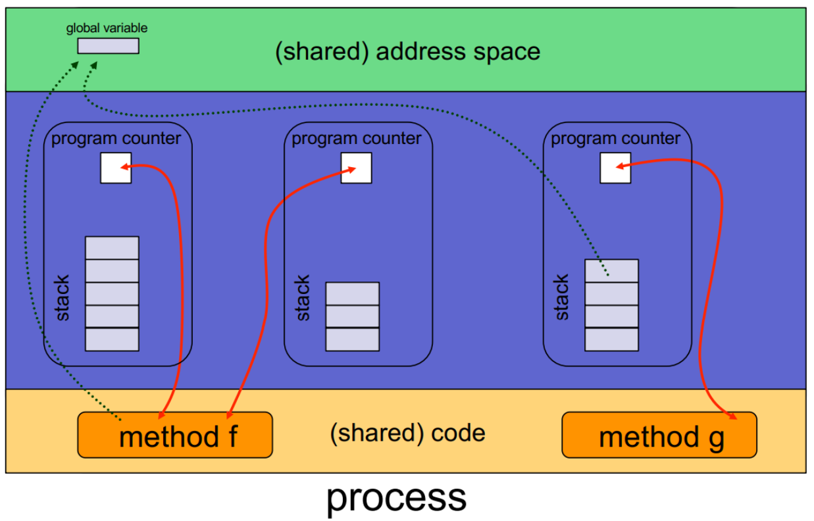

# 复习随记

## 进程与线程

进程是动态的程序，是 OS 分配资源的最小单位，可以从 OS 得到如 CPU Time，Memory 等资源。线程可以想象为存在于进程里面，是系统调度的最小单位，实际执行任务的不是进程，而是线程。可以把进程比喻为工厂，而线程是为工厂里的工人，负责任务的实际执行。

每个线程都有它自己的 thread ID, PC, register set 和 runtime stack。线程与同一进程的其他线程共享 code section, data section, heap, open files 以及 signals。





多进程与多线程: 

- 多进程好比建立许多工厂，每个工厂会分配一名员工 (thread) 执行任务，因此优势在于同一时间内可以完成较多的事
- 多线程则是将许多员工聚集到同一个工厂内，它的优势则是有机会让相同的工作在比较短的时间内完成

用户级线程和内核级线程:

**用户级线程**在操作系统上只是一个进程，这个进程包含**线程库**的部分，这部分代码负责完成线程的创建、切换等操作，**内核级线程**则是由操作系统支持这些操作

## 多核 vs 多处理器

多核 (multicore) 和多处理器 (multiprocessor) 最主要的不同在于:

- 多核指的是单个 CPU 拥有多个执行单元 (也就是核)，同时执行多个指令
- 多处理器指的是有两个或者两个以上的 CPU 系统

查看有多少个物理处理器:

```bash
 ~/ sysctl -n hw.packages
1
```

查看CPU基本信息:

```bash
 ~/ system_profiler SPHardwareDataType
Hardware:

    Hardware Overview:

      Model Name: MacBook Pro
      Model Identifier: Mac14,9
      Chip: Apple M2 Pro
      Total Number of Cores: 10 (6 performance and 4 efficiency)
      Memory: 16 GB
```

## Reference

- [zhangjiee | 多核和多处理器的区别](https://www.zhangjiee.com/wiki/os/difference-between-multicore-and-multiprocessor.html)